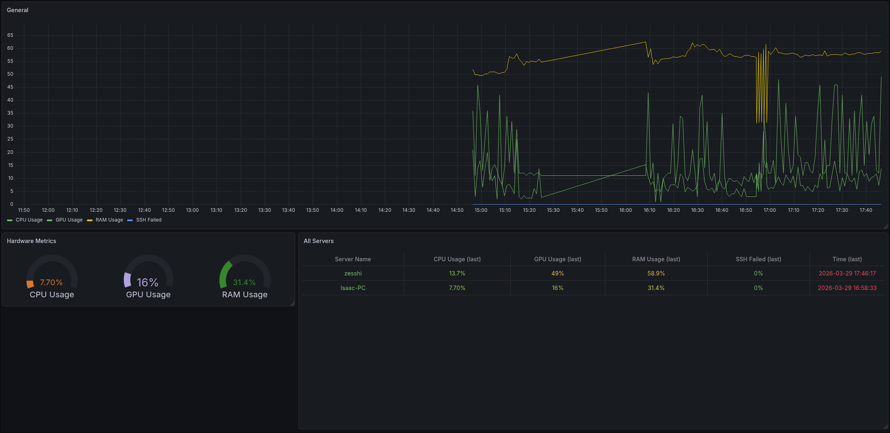
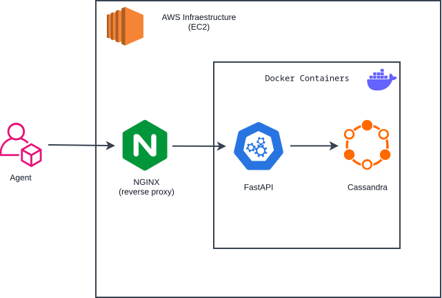

# Sentinel
A multiplatform distributed telemetry system designed to collect, process, and store metrics from remote server infrastructure.
<center>


</center>

## Overview

Sentinel is a multi-agent telemetry system designed to collect infrastructure metrics from distributed servers. \
Agents gather metrics such as CPU, RAM, and GPU usage, as well as failed SSH login attempts. The collected data is sent to an EC2 virtual machine and routed through a reverse proxy to a FastAPI service, where it is processed and stored in Amazon DynamoDB. For observability, Grafana consumes telemetry through the Infinity datasource plugin connected to the API and renders real-time dashboards.

## Architecture

The project implements a client-server architecture geared towards efficient telemetry collection and server monitoring. The entire backend environment is centralized in the cloud using an AWS EC2 instance, provisioned as Infrastructure as Code (IaC). The design prioritizes perimeter security through a reverse proxy and the isolation of internal services via containerization, ensuring that critical components are not directly exposed to the internet.
<center>


</center>

### System Components

The system is divided into the following main blocks:

- **Agent (Client):** A modular telemetry client running on target machines to collect hardware metrics and security events, then send them to the API.

- **Reverse Proxy (NGINX):** Acts as the single entry point to the server. It receives external traffic and routes it internally, hiding the network topology and container ports for security purposes.

- **Backend API (FastAPI):** The core of the business logic. It receives payloads from the agent, validates authentication, and processes the information.

- **Database (Amazon DynamoDB):** A fully managed NoSQL database service with automatic scaling, high availability, and seamless integration with the AWS ecosystem. Ideal for time-series telemetry data with flexible schema design.

- **Visualization (Grafana + Infinity Plugin):** Grafana builds dashboards by querying the FastAPI telemetry endpoint via the Infinity datasource plugin, using API-key authenticated requests.

- **Infrastructure (AWS & Terraform):** The virtualized environment where the containers reside, managed in an automated and reproducible way.

### Data Flow

The information lifecycle follows a strict process:

1. **Collection:** The agent extracts local metrics (CPU, RAM, GPU usage) and logs failed SSH connection attempts.

2. **Ingestion Request:** The agent sends telemetry data to the EC2 public endpoint.

3. **Interception:** NGINX receives the request and securely forwards it to the internal FastAPI container.

4. **Validation & Processing:** FastAPI validates the API key and payload schema.

5. **Persistence:** FastAPI writes validated telemetry to Amazon DynamoDB using `agent_id` (partition key) and `timestamp` (sort key).

6. **Visualization Query:** Grafana (Infinity datasource) sends authenticated `GET /telemetry/` requests to FastAPI.

7. **Read Path:** FastAPI retrieves telemetry records from DynamoDB and returns normalized JSON data to Grafana.

8. **Dashboards:** Grafana renders infrastructure and security metrics in real-time panels for monitoring and analysis.

### Technology Stack

- **Language:** Python

- **Web Framework:** FastAPI

- **Reverse Proxy:** NGINX

- **Database:** Amazon DynamoDB

- **Visualization:** Grafana

- **Grafana Datasource Plugin:** yesoreyeram-infinity-datasource

- **Containers:** Docker & Docker Compose

- **Infrastructure as Code (IaC):** Terraform

- **Cloud Provider:** Amazon Web Services (EC2)

### Production Recommendations

The current architecture leverages Amazon DynamoDB and Terraform for automatic infrastructure provisioning. To further scale this system to handle massive traffic and ensure operation in production environments, consider:

1. **Decoupling with Message Brokers (RabbitMQ / Kafka):** Interposing a message queue broker between FastAPI and DynamoDB. This acts as a buffer to handle extreme traffic spikes, enabling asynchronous processing, reducing API latency to near zero, and preventing the saturation of direct database connections.

2. **Multi-Region Replication:** Enabling DynamoDB global tables to replicate data across multiple AWS regions for improved availability and disaster recovery.

## Project Structure

```
proyecto-sentinel/
├── docker-compose.yml          # Orchestrates FastAPI and Grafana services
├── docs/                       # Documentation
├── terraform/
│   ├── main.tf                 # Root module orchestrating infrastructure
│   └── modules/
│       ├── compute/            # EC2, key pair, and elastic IP
│       ├── security/           # Security groups and network rules
│       ├── iam/                # IAM roles and policies for EC2
│       └── database/           # DynamoDB table provisioning
└── sentinel-api/
    ├── Dockerfile              # Container image for the FastAPI service
    ├── requirements.txt        # Pinned Python dependencies
    ├── main.py                 # FastAPI app entry point; registers routers and DB lifecycle hooks
    ├── models.py               # Pydantic schema for incoming telemetry payloads
    ├── database.py             # DynamoDB connection management (init, table, teardown)
    ├── agent/
    │   └── agent.py            # Standalone client script: collects and ships metrics to the API
    └── routers/
        └── telemetry.py        # POST /telemetry/ endpoint with API key authentication
```

## Example Telemetry Data

A payload sent by an agent to `POST /telemetry/` looks like this:

```json
{
  "server_name": "arch-workstation",
  "cpu_usage": 34.7,
  "ram_usage": 61.2,
  "gpu_usage": 12.5,
  "failed_ssh_attempts": 3
}
```

The request must include the API key in the header:

```
X-API-Key: <your-sentinel-api-key>
```

On success, the API responds with:

```json
{
  "status": "success",
  "message": "Telemetría guardada en DynamoDB"
}
```

## Getting Started

### Prerequisites

- [Docker](https://docs.docker.com/get-docker/) and Docker Compose
- Python 3.11+ (for running the agent locally)
- [Terraform](https://www.terraform.io/downloads.html) (for infrastructure provisioning)
- AWS credentials configured (for DynamoDB and EC2 access)
- An `.env` file inside `sentinel-api/` with the following variables:

```env
SENTINEL_API_KEY=your_secret_key_here
AWS_REGION=us-east-1
DYNAMODB_TABLE=sentinel_data
```

### 1. Provision Infrastructure with Terraform

```bash
cd terraform
terraform init
terraform plan
terraform apply
```

This creates:
- EC2 instance with Docker and required tools
- Security group with SSH and HTTP access
- DynamoDB table for telemetry storage
- IAM role and instance profile for EC2 access to DynamoDB

### 2. Start the Backend and Visualization Stack

```bash
docker compose up --build -d
```

This launches the service containers:
- `sentinel-api-v3` — the FastAPI service on port `8000`
- `sentinel-grafana` — Grafana on port `3000` (Infinity datasource plugin installed at startup)

**Note:** The API will connect to DynamoDB using AWS credentials from the EC2 instance or your local AWS configuration.

### 3. Verify the API is Running

```bash
curl http://localhost:8000/health
```

### 4. Access Grafana

Open Grafana in your browser:

```bash
http://localhost:3000
```

Then configure a dashboard using the Infinity datasource against the API telemetry endpoint.

### 5. Run the Agent

On any machine you want to monitor, install the agent dependencies and execute it:

```bash
pip install psutil requests python-dotenv
python sentinel-api/agent/agent.py
```

The agent will collect local CPU, RAM, GPU, and failed SSH metrics and POST them to the API endpoint.


## Roadmap

This project is in continuous evolution. While the current version provides a solid and functional foundation, the following enhancements are planned for future iterations:

- [ ] **Message Broker Integration:** Implement Apache Kafka as a messaging queue between the FastAPI backend and the database. This will allow the system to handle high concurrency, manage traffic spikes, and enable asynchronous data processing.

- [x] **CI/CD Pipelines:** Establish Continuous Integration and Continuous Deployment (CI/CD) workflows (e.g., using GitHub Actions) to automate testing, container image builds, and the Terraform infrastructure provisioning.

- [x] **Data Visualization:** Deploy Grafana to create interactive, real-time dashboards. This will transform the raw telemetry data and security logs into beautiful, easy-to-monitor visual metrics.

Continuous Improvement: The architecture is designed to be extensible, leaving room for future additions such as real-time alerting systems or migrating to managed cloud services as new requirements arise.

## Motivation

Sentinel was developed as a hands-on project to deepen my practical understanding of Infrastructure as Code (IaC) using Terraform within a real-world cloud environment.

By leveraging the AWS Free Tier, my goal was to build a fully functional data pipeline from scratch. This project has been instrumental in solidifying my knowledge of how containerized applications (Docker) operate in production, how to design scalable backend architectures, and how to implement essential security practices in a cloud ecosystem.
